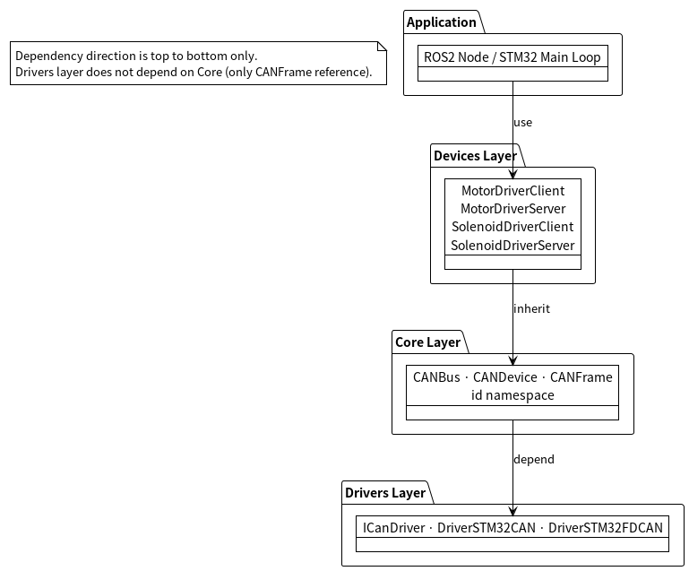
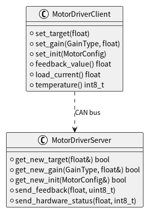
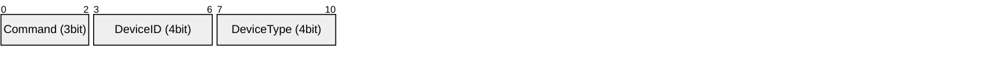

# アーキテクチャ解説

このドキュメントでは `gn10-can` の設計判断の背景と意図を説明します。
**「なぜこう作ったのか」** を理解することで、拡張時の設計破壊を防ぎます。

---

## 目次

1. [全体構造](#1-全体構造)
2. [3層分離の設計意図](#2-3層分離の設計意図)
3. [RAII によるデバイス管理](#3-raii-によるデバイス管理)
4. [Client / Server パターン](#4-client--server-パターン)
5. [CAN ID の設計](#5-can-id-の設計)
6. [設計上の制約と理由](#6-設計上の制約と理由)

---

## 1. 全体構造



依存の方向は **上から下のみ** です。Drivers 層は Core に依存しません（`CANFrame` のみ参照）。

---

## 2. 3層分離の設計意図

### Core 層
「何を送るか・どこに届けるか」を担当します。
マイコンの種類に依存しない純粋なC++コードのみで構成されており、Linux上でのテストが可能です。

### Drivers 層
「どうやってハードウェアと通信するか」を担当します。
`ICanDriver` インターフェースを実装するだけで新しいマイコンに対応できます。
Core 層は `ICanDriver` の具体的な実装を知りません（依存性逆転の原則）。

### Devices 層
「各デバイスのプロトコルをどう解釈するか」を担当します。
新しいデバイスを追加するときは `CANDevice` を継承してこの層に追加します。
Core/Drivers 層を変更する必要はありません。

---

## 3. RAII によるデバイス管理

### 仕組み

`CANDevice` のコンストラクタは自動的に `CANBus::attach()` を呼び出します。
デストラクタは自動的に `CANBus::detach()` を呼び出します。

```cpp
// この1行だけでバスへの登録が完了する
gn10_can::devices::MotorDriverClient motor{bus, 1};
// motor が破棄されたとき、自動的にバスから登録解除される
```

### ⚠️ 重要: ライフタイムの規則

**`CANBus` は必ず `CANDevice` より長く生存しなければなりません。**

```cpp
// OK: CANBus が先に構築され、後に破棄される（宣言順）
gn10_can::CANBus bus{driver};
gn10_can::devices::MotorDriverClient motor{bus, 1};
// motor が先に破棄 → バスから適切にデタッチ
// bus が後に破棄

// NG: スコープを用いた誤った例（dangling reference）
{
    gn10_can::CANBus bus{driver};
}  // ← ここで bus が破棄される
gn10_can::devices::MotorDriverClient motor{bus, 1};  // 未定義動作
```

**コピーとムーブは禁止されています。** `CANDevice` はバスへのポインタで管理されており、
アドレスが変わると登録情報が壊れます。

### 最大デバイス数

`CANBus::MAX_DEVICES = 16` が上限です。組み込みシステムの規模を想定して固定長配列で管理しており、動的メモリは使いません。

---

## 4. Client / Server パターン

1つのデバイスに対して、役割の異なる2つのクラスが対称的に存在します。



**Server 側の `get_new_*()` は `std::optional` ベースの設計です。**
新しい値が届いていないときは `false` を返します。

```cpp
// Server 側での読み出し例
float target;
if (server.get_new_target(target)) {
    // 新しい目標値が届いていた場合のみ処理
    set_motor_target(target);
}
```

---

## 5. CAN ID の設計

### ビット割り当て (Standard ID: 11bit)



| フィールド | ビット幅 | 範囲 | 用途 |
| :--- | :--- | :--- | :--- |
| DeviceType | 4 bit | 0–15 | デバイスの種類 (MotorDriver, Solenoid...) |
| DeviceID | 4 bit | 0–15 | 同種デバイスの枝番 |
| Command | 3 bit | 0–7 | メッセージ種別 (Init/Target/Feedback...) |

### ルーティング

`CANBus::dispatch()` は `get_routing_id()` (DeviceType + DeviceID の上位8bit) で
`on_receive()` を呼ぶデバイスを絞り込みます。
Command ビットを含めた完全なフィルタリングは各デバイスの `on_receive()` 内で行います。

---

## 6. 設計上の制約と理由

| 制約 | 理由 |
| :--- | :--- |
| 動的メモリ不使用 | 組み込みシステムでのヒープ断片化・非決定的遅延を回避 |
| `CANDevice` のコピー/ムーブ禁止 | バスへのポインタ管理の一意性を保証するため |
| `receive()` は非ブロッキング | メインループ・割り込みどちらからでも呼べるようにするため |
| Client/Server を分離 | 上位/下位マイコンで同じライブラリを使いつつ役割を明確化するため |
| `MAX_DEVICES = 16` | 11bit CAN ID で最大16種×16個 = 256デバイス、1バスあたり16ノード以下を想定 |
